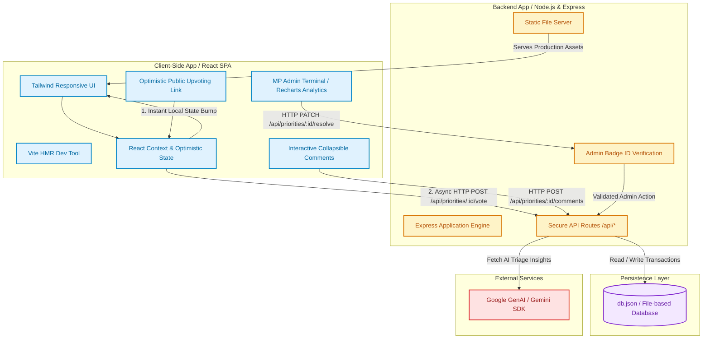
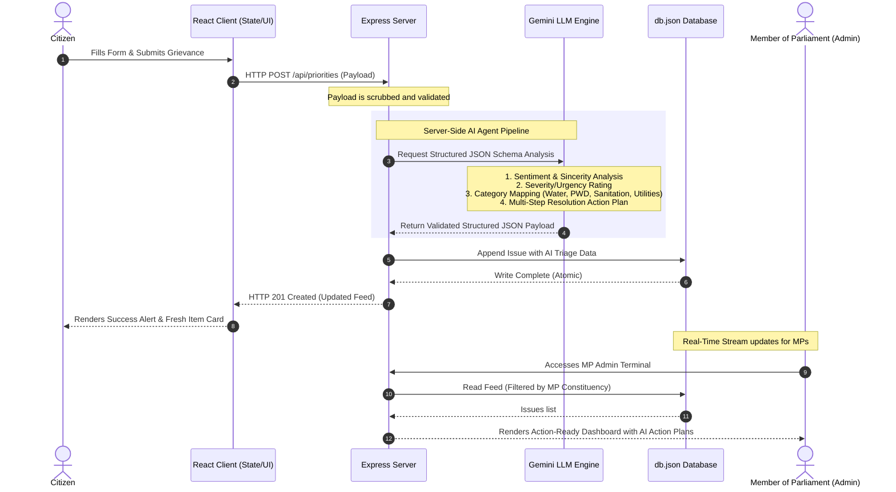

# CivicLens 🏛️

A mobile-first, full-stack, AI-enhanced civic engagement platform designed for democratic priority ranking, constituent coordination, and public grievance triage under the **People's Priorities** governance framework.

🔗 **Live Deployment URL:** [CivicLens Application](https://ais-pre-qhppj7caeqjjxbd5ny56y4-212476535661.asia-southeast1.run.app)

---

## 📖 Product Overview

**CivicLens** empowers citizens to voice local concerns, collaborate on collective priorities, and establish direct channels of visibility with their elected representatives. Designed with high-performance mobile-first interactions, CivicLens bridges the gap between public advocacy and administrative action.

Whether reporting infrastructure issues, highlighting public service gaps, or viewing analytical summaries of a constituency, CivicLens transforms public grievances into transparent, structured, and actionable community priorities.

---

## 🗺️ Architectural Diagrams

### 1. Website & System Architecture Flow

This diagram illustrates the full-stack architecture of CivicLens, showing the boundaries between client-side state machine mechanics, the Express server routing layers, and secure persistence/third-party API layers.



#### Detailed Flow Narrative:
1. **The Optimistic UI Upvoting Loop**: When a citizen votes on a local priority, the client-side state instantly increments the count and toggles the active button state (1). Simultaneously, an asynchronous background request is fired to the Express proxy (2). If the request fails, the state gracefully rolls back, protecting user experience.
2. **Administrative Action Authentication**: When an MP accesses the Admin Terminal, their credentials (such as constituency assignments or badge IDs) are verified. Only verified administrators can post official replies or transition a priority to the `Resolved` state.
3. **Database Write Safety**: The Node server coordinates reads and writes to `db.json` asynchronously, ensuring state consistency across concurrently active citizens.

---

### 2. Agentic Grievance Triage Pipeline (AI Flow)

When a citizen submits a new civic concern, CivicLens initiates a multi-stage background triage flow utilizing Google GenAI (Gemini) models to translate unformatted human language into highly structured administrative items.



#### Detailed Agent Triage Mechanics:
- **Zero Hallucination Parsing**: The Gemini API is constrained with strict system instructions and a rigorous JSON Schema. This ensures that the response always matches the exact `aiTriage` model signature required by TypeScript.
- **Categorization Guardrails**: Incoming requests are mapped into standardized municipal categories to prevent spam and out-of-scope complaints (such as joke submittals) from cluttering municipal workflows.
- **Synthesized Resolution Action Plans**: For genuine public concerns, the AI agent crafts custom checklist plans (e.g., specifying isolation valves for water mains or power sensor replacements for broken streetlights) so administrators have a structured, immediate path to resolution.

---

## ✨ Core Features

### 1. 📍 Multi-Constituency Stream Triage
- Supports all major Parliamentary constituencies of Delhi:
  - **Chandni Chowk**
  - **East Delhi**
  - **New Delhi**
  - **North East Delhi**
  - **North West Delhi**
  - **South Delhi**
  - **West Delhi**
- Real-time stream switching allows constituents to discover localized priorities or navigate a broader citywide feed.

### 2. 🧠 AI-Powered Grievance Triage (Gemini-Enhanced)
- Incoming reports undergo automated server-side natural language analysis via **Google GenAI (Gemini)**.
- **Categorization**: Automatically classifies submissions into critical sectors (e.g., Water Supply, Public Health, Sanitation, Potholes, Traffic Safety).
- **Urgency Indicator**: Evaluates environmental hazard levels, safety factors, and scope to assign an objective urgency score.
- **Action Plan Generation**: Synthesizes a structured multi-step blueprint to guide administrators through standard resolution steps.

### 3. 🗳️ Democratic Upvoting & Optimistic UI
- Features high-fidelity upvoting loops with optimistic client state updates. Upvotes register instantly on the screen while network requests proceed in the background, falling back cleanly in case of a connection drop.
- **Automated Promotion**: Once an issue secures five or more public upvotes, the platform's lifecycle engine automatically escalates it from `Recently Raised` to `Under Consideration`.

### 4. 🎛️ Representative Command Console (MP Admin Terminal)
- Built-in portal for lawmakers, MPs, and administrators representing specific constituencies.
- **Dedicated Admin Profiles**: Features pre-loaded profiles for Delhi’s administrative representatives:
  - **Hon. Rajesh Vardhan** (Chandni Chowk)
  - **Hon. Gautam Gambhir** (East Delhi)
  - **Hon. Manoj Tiwari** (North East Delhi)
  - **Hon. Hans Raj Hans** (North West Delhi)
  - **Hon. Ramesh Bidhuri** (South Delhi)
  - **Hon. Parvesh Verma** (West Delhi)
- **Grievance Resolution Lifecycle**: Admins can directly respond to public issues, provide official updates, or mark a priority as officially `Resolved`.
- **Analytics Dashboard**: Visualizes priority density, resolution rates, and sector-by-sector breakdowns using interactive charts.

### 5. 🔑 Client-Side Persona Management
- Easy profile swapping with persistent local storage.
- Custom avatar generation powered by robust vector styling for an elegant personal presentation.

---

## 🛠️ Technology Stack

- **Frontend Core**: React 18, Vite, TypeScript
- **Styling & Motion**: Tailwind CSS, `motion` (by motion/react) for micro-animations and staggered transitions
- **Visualization & UI Accessories**: Recharts for responsive analytical dashboards, Lucide React for consistent modern icon pairings
- **Backend Architecture**: Node.js, Express server with active API routes hosting server-side JSON persistence and secure API proxies
- **AI Triage Integration**: Server-side Google GenAI (Gemini) SDK client

---

## 🚀 Local Development Setup

To run CivicLens locally, follow these simple steps:

### Prerequisites
- Node.js (v18 or higher)
- npm or yarn

### 1. Clone & Extract
Export or extract the project codebase into your local development folder.

### 2. Configure Environment Variables
Create a `.env` file at the root of the project and specify your Gemini API key:
```env
GEMINI_API_KEY=your_gemini_api_key_here
```

### 3. Install Dependencies
Install all package dependencies configured inside `package.json`:
```bash
npm install
```

### 4. Start the Application
Run the developer pipeline, which starts the Express backend alongside the Vite client middleware:
```bash
npm run dev
```
Open your browser and navigate to `http://localhost:3000` to interact with CivicLens locally.

---

## 📦 How to Export to GitHub

Since this application is developed in Google AI Studio, you can directly push this repository to your personal GitHub account or export it as a clean archive:

1. **Export as ZIP / GitHub Repository**:
   - Locate the **Settings** menu (gear icon) in the upper right-hand corner of the Google AI Studio Build workspace.
   - Click **Export to GitHub** to link your GitHub account and instantly create a clean, fully-populated repository.
   - Alternatively, choose **Download ZIP** to retrieve the complete codebase for manual upload.
2. **Commit with Confidence**:
   - All environment variables, API secret layers, and development scripts are already fully prepared to run seamlessly in any standard cloud-hosted environment.
